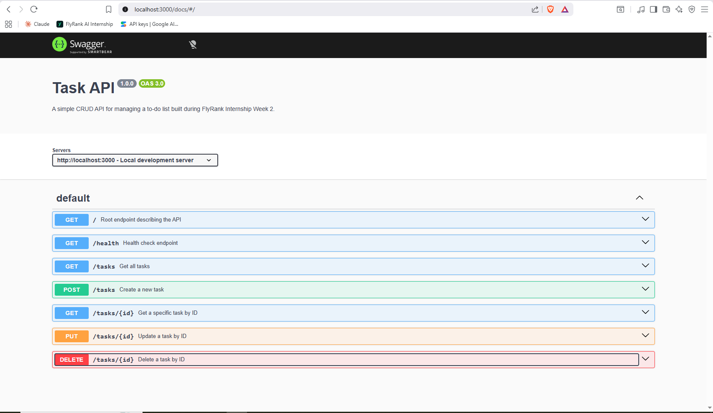
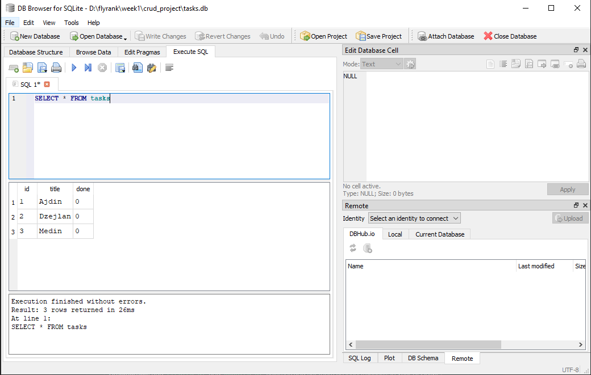
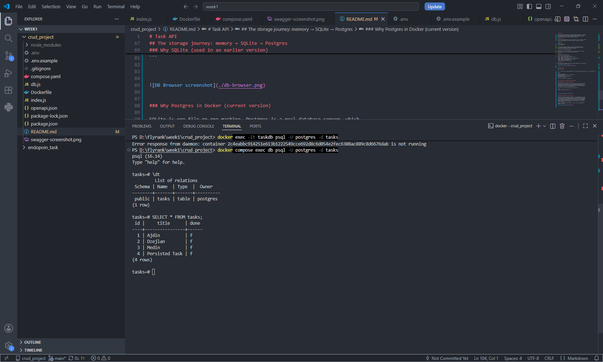

# Task API

Simple to-do list API I built for the FlyRank backend internship. It started as
an in-memory CRUD API, then moved to SQLite so data would survive a restart,
then moved again to a real Postgres database running in Docker. The five
endpoints never changed — only where the data lives did.

## What this is

A REST API for managing tasks: create, read, update, delete. Full CRUD, tested
with curl and Swagger UI, now backed by Postgres running in a container.

## Running it

```bash
cp .env.example .env
docker compose up
```

That's the one command. It brings up the app and the database together.
`.env.example` lists every variable you need to set — the real `.env` is
git-ignored so no password ever ends up in the repo.

Server runs at http://localhost:3000

The database, its `tasks` table, and the three seed tasks are all created
automatically on first run — nothing to set up by hand.

## Endpoints

| Method | Path | What it does |
|--------|------|---------------|
| GET | / | basic info about the API |
| GET | /health | just returns `{ "status": "ok" }` |
| GET | /tasks | list all tasks |
| GET | /tasks/:id | get one task, 404 if it doesn't exist |
| POST | /tasks | create a task, needs a "title" |
| PUT | /tasks/:id | update a task |
| DELETE | /tasks/:id | delete a task |

## Swagger docs

Once the server's running, go to http://localhost:3000/docs to test everything
in the browser instead of using curl.




## Example request

Creating a task:

```
curl -i -X POST http://localhost:3000/tasks -H "Content-Type: application/json" -d '{"title":"Buy milk"}'
```
Output: 
```
HTTP/1.1 201 Created
Content-Type: application/json; charset=utf-8
Content-Length: 46
Date: Wed, 29 Jul 2026 20:10:00 GMT
Connection: keep-alive

{"id":4,"title":"Buy milk","done":false}
```

## The storage journey: memory → SQLite → Postgres

### Why SQLite (used in an earlier version)

I used SQLite at first because it's just a single file — no server to install,
no setup, and unlike the very first in-memory version, the data actually
survived a restart. The file was `tasks.db`, created automatically the first
time the app ran, and it was git-ignored so every fresh clone started empty
and reseeded itself with the three example tasks.

One query I ran by hand in DB Browser against `tasks.db`:

```sql
SELECT * FROM tasks WHERE done = 0;
```





### Why Postgres in Docker (current version)

SQLite is one file on one machine. Postgres is a real database server, which
is what most production backends actually run on — FlyRank included. Running
it in Docker means I don't install Postgres directly or fight version issues;
it's a container that behaves identically on any machine, and it disappears
cleanly with `docker compose down` if I want a fresh start. The data itself
doesn't disappear, though — it's kept in a Docker volume, so it survives a
`docker compose down` + `up` cycle.





